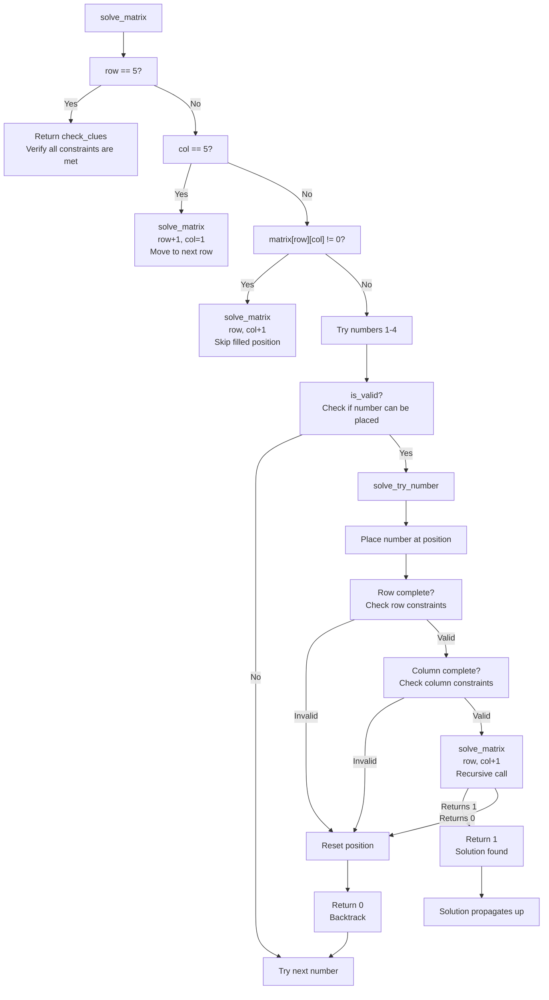

# Rush-01 Solver Algorithm Explanation

## Recursive Backtracking Algorithm

The solution uses a recursive backtracking algorithm to solve the skyscraper puzzle. Below is a diagram showing the relationship between the two main recursive functions: `solve_matrix` and `solve_try_number`.

## Explanation of the Algorithm Flow

1. **solve_matrix Function**:
   - Takes the current state of the matrix and the position (row, col) to fill
   - If row is 5 (beyond the puzzle area), it verifies if all constraints are satisfied
   - If col is 5, it moves to the next row
   - If current position is already filled, it skips to the next position
   - Otherwise, it tries numbers 1-4 at the current position

2. **solve_try_number Function**:
   - Attempts to place a specific number at a specific position
   - Checks if the placement causes any immediate constraint violations
   - If constraints are still valid, it calls back to solve_matrix to continue solving
   - If solve_matrix returns successful, the solution propagates back up
   - If no solution is found, it resets the position and returns 0 to backtrack

3. **Backtracking Mechanism**:
   - When a placement leads to a dead end, the algorithm backtracks
   - It resets the current cell and tries the next number
   - If all numbers are exhausted, it returns 0 to signal failure to the previous recursive call
   - This causes the previous cell to try the next number

This recursive algorithm will either find a valid solution that satisfies all constraints or exhaust all possibilities and determine that no solution exists.